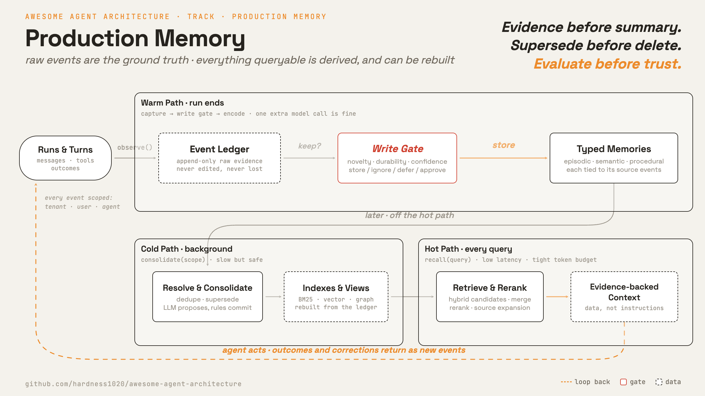

<h1 align="center" style="margin-top: 0;">Learn Agent Memory</h1>

<p align="center">
  <strong>了解 production 的 agent 是怎麼記住東西的</strong><br>
</p>

<p align="center">
  <a href="#各章節"></a>
  <a href="#研究的系統"></a>
  <a href="#各章節"></a>
  <a href="LICENSE"></a>
</p>

<p align="center">
  <a href="README.md">English</a> · <strong>繁體中文</strong> · <a href="README.zh-CN.md">简体中文</a>
</p>

Production 的 agent memory 不是一個向量資料庫，而是一套系統：原始證據完整保留，查詢用的 memory 都從證據整理出來，隨時可以重建。

多數 agent 都跑同一套最小可行的 memory loop：一個檔案儲存區、一份索引、turn 開始時 recall、
run 結束時 extraction，再加一份原始 session log。顧一個使用者、一個 agent，那個 loop 就夠了。
但 production 的 memory 要面對多個 tenant、多個 agent，還有累積好幾年的歷史。
到了這個規模，memory 本身就是一個子系統，有自己的 lifecycle、自己的時鐘、自己的失效模式。
這個 repo 把那個 loop 一章一章放大成完整的 memory 子系統，每一章對應一個設計決策。

**目錄：** [Memory pipeline](#memory-pipeline) · [學習方法](#學習方法) ·
[研究的系統](#研究的系統) · [各章節](#各章節) · [檔案結構](#檔案結構) · [執行檢查](#執行檢查)

---

## Memory pipeline



整個設計最重要的一條規則：

> 原始事件不可丟。整理出來的 memory 隨時可以重建。

Capture 之後的每一層都是 view：從事件算出來、給查詢用的一份副本，永遠不是唯一的一份。
extraction、consolidation 或索引壞掉都沒關係，從 event log 重新算一次就好。
[MemMachine](https://arxiv.org/abs/2604.04853) 也是同樣的立場：
完整的 episode 留著當 ground truth，profile、索引和 contextual retrieval 都疊在上面。

### 三條時鐘

同一套系統其實跑在三種節奏上：查詢當下走 hot path，一次 run 結束走 warm path，背景整理走 cold path。

| | Hot path | Warm path | Cold path |
| --- | --- | --- | --- |
| **時機** | 每個 query | run 結束時 | 背景或排程 |
| **工作** | plan、retrieve、rerank、assemble、inject | 寫入原始事件、write gate、抽出 memory candidate | consolidate、去重、supersede、更新 profile、重建索引、評估 |
| **限制** | 低 latency，嚴格的 token budget | 可以多一次 model call，但不能擋太久 | 可以慢，但必須安全 |

最小可行的 loop 已經有這個雛形：turn 前 recall、run 結束 extraction、背景 consolidation。
這條 track 沿用同樣的三條時鐘，把每一條放大。

---

## 學習方法

每一章都可獨立閱讀，都用同一組四個面向來看：

1. **開場：** 這一章要解決什麼問題。
2. **機制：** 有哪些元件，資料怎麼流動。
3. **各系統做法：** 真實系統是怎麼實作的，整理成一張表。
4. **哪裡會出錯：** 常見的出錯情況，以及怎麼緩解。

怎麼從這個 repo 學習：

- **照順序讀各章節。每一章都建立在前一章之上**。
- 每一章都能跑離線檢查：`python sections/NN-name/src/test.py`，不需要金鑰。
- 把某章的 `src/` 跟前一章對比（diff），這個差異就是這一章新增的那個機制。

---

## 研究的系統

每個系統都是所列章節 per-system 表格裡的實作範例。

| 系統 | 大家為什麼用它 | 值得看的地方 | 覆蓋章節 |
| --- | --- | --- | --- |
| **[Claude Code](https://docs.claude.com/en/docs/claude-code/memory)** | 目前最強的 coding agent，auto memory 以 project 目錄為單位存 markdown 檔案。 | Scoped store、背景 consolidation | 1、5 |
| **[Hermes Agent](https://github.com/NousResearch/hermes-agent)** | 長期助理：記得你、學會你的工作流程，還能跨平台跑任務。 | 原始 session log、需要核准的寫入 | 1、2、3 |
| **[MemMachine](https://arxiv.org/abs/2604.04853)** | 開源的 memory 層，完整的對話 episode 留著當 ground truth。 | Episode ledger、contextual retrieval | 2、8 |
| **[Mem0](https://arxiv.org/abs/2504.19413)** | 被廣泛使用的 memory 層，store 走精選路線：新事實併進去，不是一直堆。 | LLM write gate | 3 |
| **[LangMem](https://github.com/langchain-ai/langmem)** | LangChain 的 memory SDK，record 寫入時會過 app schema 檢查。 | Typed record 和 profile | 4 |
| **[Hindsight](https://arxiv.org/html/2512.12818v1)** | 把事實、觀察和意見分開存的 memory engine。 | Epistemic type、reflection | 4 |
| **[Graphiti / Zep](https://arxiv.org/abs/2501.13956)** | temporal knowledge graph memory：舊事實標成過期留著，不會被蓋掉。 | Bitemporal 欄位、`SUPERSEDE` | 5 |
| **[A-Mem](https://arxiv.org/html/2502.12110v1)** | agentic memory：新 note 會自己連結並更新舊 note。 | Dynamic linking、agentic consolidation | 6 |
| **[Sleep-time Compute](https://arxiv.org/html/2504.13171v1)** | 把 consolidation 移出查詢的 hot path，改在背景做。 | Cold path 的 consolidation | 6 |
| **[AgentRunbook-C](https://arxiv.org/abs/2605.12493)** | 把 trajectory 存成檔案，讓 coding agent 在 sandbox 裡自己搜尋。 | Agentic file retrieval | 8 |

> 第 7 到 10 章比較的是設計模式（wiki 對 graph view、retrieval 策略、assembly 政策、指標），不是單一系統。

---

## 各章節

十章，每一章都是一個獨立的設計決策。每一列都連到一篇可獨立閱讀、附可執行程式的說明。

| #  | 章節                                                                     | 問題                             | 關鍵機制                                                   |
| -- | ------------------------------------------------------------------------ | -------------------------------- | ---------------------------------------------------------- |
|    | **Extraction** | | |
| 1  | [Memory contract](sections/01-memory-contract/README.zh-TW.md)                     | 這是誰的 memory？                | Scope, tenant and user isolation, retention, sensitivity   |
| 2  | [Event ledger](sections/02-event-ledger/README.zh-TW.md)                           | 什麼算是證據？                   | Append-only log, `occurred_at` vs `recorded_at`            |
| 3  | [Write policy](sections/03-write-policy/README.zh-TW.md)                           | 值不值得記？                     | Novelty, durability, explicit write decisions              |
| 4  | [Typed memory](sections/04-typed-memory/README.zh-TW.md)                           | 這是哪一種 memory？              | Episodic, semantic, procedural, epistemic types            |
|    | **Consolidation** | | |
| 5  | [Temporal resolution](sections/05-temporal-resolution/README.zh-TW.md)             | 是矛盾，還是更新？               | Bitemporal fields, `SUPERSEDE`, non-destructive operations |
| 6  | [Consolidation](sections/06-consolidation/README.zh-TW.md)                         | 事件怎麼變成知識？               | Compression, abstraction, propose-validate-commit          |
| 7  | [Index views](sections/07-index-views/README.zh-TW.md)                             | 一份 ledger 怎麼支撐多種查法？   | Sparse, dense, temporal, graph, wiki, profile views        |
|    | **Recall** | | |
| 8  | [Hybrid retrieval](sections/08-hybrid-retrieval/README.zh-TW.md)                   | 怎麼找到對的 memory？            | BM25 plus vector plus graph, source expansion, routing     |
| 9  | [Context assembly](sections/09-context-assembly/README.zh-TW.md)                   | memory 怎麼安全放回 context？    | Evidence bundles, token budget, untrusted-data framing     |
| 10 | [Evaluation and governance](sections/10-evaluation-governance/README.zh-TW.md)     | memory 真的有幫上忙嗎？          | Write, retrieval, context, and end-to-end metrics          |

---

## 檔案結構

```text
learn-agent-memory/
├── README.md                      # 最上層地圖
├── sections/                      # 每個章節一個資料夾
│   ├── 01-memory-contract/        # 每章一份 README.md，可執行的程式碼鏈從這裡開始
│   ├── ...
│   └── 10-evaluation-governance/  # 完整的 engine 在這裡
└── assets/                        # 共用圖片
```

每個章節資料夾都是 `NN-name/` 格式，裡面有 `README.md`、`README.zh-TW.md`、`README.zh-CN.md`，還有可執行的 `src/`。
每一章都把前一章的 `src/` 帶過來，再加上一個新機制，
所以相鄰兩章的 diff 就是那一章的機制，第 10 章就是完整的 engine。

---

## 執行檢查

所有程式碼都是 stdlib Python（dataclasses、sqlite3）。沒有第三方套件，不需要 API key，也不用安裝。

每一章都有 `test.py` 做離線檢查。從 repo 根目錄執行：

```bash
python sections/01-memory-contract/src/test.py
```

---

## 參與貢獻

- **新增一個系統。** 把新的 memory 系統放進某一章的 per-system 表格裡。
- **深化某一章。** 補上一個機制、更清楚的圖，或更精準的出錯分析。
- **修正內容。** 這些頁面都是從論文和文件重建出來的教學內容。歡迎附上出處的修正。

請優先採用有名字、可查證的機制，而不是臆測。記得引用出處。

---

## 參考資料

- [MemMachine](https://arxiv.org/abs/2604.04853)：主張保留 ground truth 的 memory 系統，retrieval 時帶出完整 episode 的前後文。
- [Zep / Graphiti](https://arxiv.org/abs/2501.13956)：用 temporal knowledge graph 做 agent memory，事實帶兩種時間。
- [Hindsight](https://arxiv.org/html/2512.12818v1)：retain、recall、reflect 三步，把事實、觀察和意見分開存。
- [A-Mem](https://arxiv.org/html/2502.12110v1)：agentic memory，新 note 會自己連結並更新舊 note。
- [Memory-R1](https://arxiv.org/html/2508.19828v2)：用 RL 訓練 memory manager，學著選 `ADD / UPDATE / DELETE / NOOP`。
- [Sleep-time Compute](https://arxiv.org/html/2504.13171v1)：趁沒有 query 時在背景先整理，省下查詢當下的成本。
- [Karpathy 的 LLM Wiki](https://gist.github.com/karpathy/442a6bf555914893e9891c11519de94f)：idea file 原文。
  由 LLM 維護的 markdown wiki，原始來源永遠不動，頁面都從它整理出來。
- [HippoRAG](https://arxiv.org/abs/2405.14831)：knowledge graph 加 Personalized PageRank，要串好幾步的證據一次就查齊。
- [LongMemEval](https://arxiv.org/abs/2410.10813)：長期互動 memory 的 benchmark，五類任務。
- [LongMemEval-V2](https://arxiv.org/abs/2605.12493)：把 benchmark 擴到 agent 的工作經驗，AgentRunbook-C 的檔案式檢索出自這裡。
